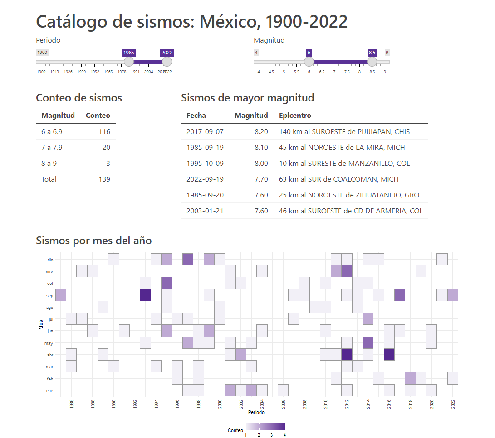

# Catálogo de sismos del Sistema Sismológico Nacional de México

Este es un *dashboard* que presenta los datos de sismos, de magnitud mayor o igual a 4, ocurridos en México desde el 1900-01-01 hasta 2022-09-22.

Los datos han sido recuperados del catálogo de sismo del Sistema Sismológico Nacional (SSN) de México:

* http://www2.ssn.unam.mx:8080/catalogo/

Una versión de este *dashboard* se encuentra alojada en ShinyApps:

* https://jboscomendoza.shinyapps.io/catalogo-sismos-mexico/ 

El *dashboard* ha sido creado con el paquete *shiny* 1.72 usando **R** 4.2.1, así como los siguientes paquetes:

* *dplyr* 1.0.10
* *ggplot2* 3.3.6
* *Hmisc* 4.7-1
* *lubridate* 1.8.0
* *RColorBrewer* 1.1-3
* *readr* 2.1.2
* *stringr* 1.4.1
